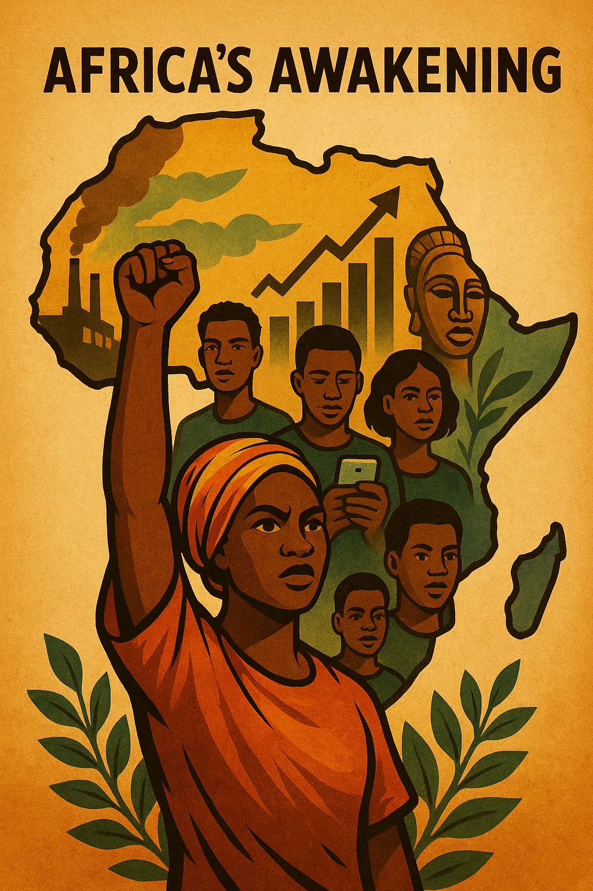

**Africa's Awakening: Growth, Challenges, and New Opportunities in a Global Context**

(AI generated with ChatGPT 4o/Deep research; Image generated with Sora)

Africa is undergoing profound transformation. Once predominantly portrayed through narratives of crisis and poverty, the continent is increasingly seen as a dynamic engine of growth, innovation, and cultural influence. Yet this awakening is layered and complex: alongside notable economic advances, structural challenges persist. This essay explores Africa's transformation across the dimensions of growth, digitalisation, industry, energy, culture, and governance.

---

### 1. Growth: The Continent of the Future

Looking back at 2025, data from the International Monetary Fund indicates that Africa remained one of the world’s most dynamic economic regions, with several nations ranking among the fastest-growing economies globally [12]. However, the composition of these leading nations shifted drastically compared to early forecasts, revealing a fundamental truth about the continent’s current trajectory: size no longer equals economic dynamism in Africa. The real story of the continent’s growth belongs to the policy innovators, not the legacy giants.

While South Sudan — originally expected to lead global rankings — faced a severe economic contraction due to the Sudan oil pipeline crisis, agile mid-tier reformers stepped into the vanguard. According to the IMF’s April 2026 data, the continent’s strongest real GDP growth performers included:

* **Libya** (15.9%) — Reflecting a major recovery in oil production and stabilized exports.
* **Ethiopia** (9.2%), Rwanda (7.0%), and Uganda (6.7%) — Representing East Africa’s reform-led vanguard, where growth is anchored in sweeping structural market overhauls, regional trade integration, and heavy corridor infrastructure investments.
* **Guinea** (6.7%) — Maintaining strong momentum through baseline infrastructure development ahead of massive, imminent mining exports from the Simandou iron ore project.
* **Côte d’Ivoire** (6.5%) — Driven by high international cocoa values boosting rural incomes, expanding tertiary services, and strong private investment.
* **Benin** (6.2%) — Propelled by sustained public works, port modernization, and the scaling of the export-oriented Glo-Djigbé Industrial Zone.

Meanwhile, traditional heavyweights like South Africa and Nigeria slugged through structural bottlenecks and intense inflationary stabilization cycles. Ultimately, these 2025 trends illustrate an economic landscape characterized less by the weight of massive legacy markets, and far more by a sharp divide between volatile, resource-driven rebounds and increasingly resilient, reform-led expansions.

Beyond these fluctuating commodity cycles, the continent’s long-term trajectory is anchored by its most significant asset: a vibrant, youthful population. With more than 60% of Africans under the age of 25 and a median age of just 19, this demographic energy does more than just drive consumer demand — it is actively shifting the continent from a legacy resource economy into a dynamic hub for digital transformation, technical talent, and localized innovation.

An estimated 12 million young people enter the labour force annually, yet only about 3 million formal jobs are created. Initiatives like Ethiopia's Jobs Creation Commission and South Africa's Youth Employment Service aim to narrow this gap. Nigeria adds approximately 600,000 total graduates annually [7], while the 3 Million Technical Talent (3MTT) program, run by the Federal Ministry of Communications, Innovation & Digital Economy, aims to train 3 million Nigerians in technical skills to support Nigeria’s broader digital economy and job creation strategy under President Bola Ahmed Tinubu [8]. Africa's consumer expenditure has reached approximately US $2.1 trillion [9], and the start-up scene is thriving—driven by a record 63% year-on-year growth in debt funding as of 2025 [10].

Africa's population is projected to reach 3.3 billion by 2075, meaning one in three people globally will be African. This demographic trend significantly impacts the global workforce, as by 2030, half of all new entrants to the global workforce will be from Africa.

### 2. Digitalisation as a Key Factor

Africa’s digital landscape is rapidly expanding. Internet penetration has climbed from about 28 percent in 2019 to roughly 42 percent in 2026. 4G coverage now reaches roughly two-thirds of Africa’s population, while 5G — still at an early stage — has been launched in about 28 African countries.

Nigeria’s developer talent is experiencing sustained, multi-year momentum. Recent data from GitHub highlights the country as a primary driver for the millions of new developers emerging across the Africa and Middle East region. Over the past few years, Nigeria has not only recorded the fastest talent growth on the continent but has officially surpassed 1.1 million developers, solidifying its position as the largest tech community in Africa. By early 2026, Nigeria’s GitHub user base is estimated to reach up to 1.6 million, closely followed by Egypt’s rapidly expanding community of around 1.35 million engineers.

In 2024, Africa’s mobile-driven digital economy reached a significant milestone, contributing $220 billion in economic value, which represents 7.7% of the continent’s total GDP [7]. This growth is supported by a mobile-first consumer base and an increasingly mature digital infrastructure. Sub-Saharan Africa remains the global epicenter of the industry, processing $1.1 trillion in transactions—accounting for roughly 66% of the $1.68 trillion global mobile-money value (GSMA, 2025). Kenya’s M-Pesa and similar platforms have become cornerstones of financial inclusion. 

Tech hubs in cities like Nairobi, Lagos, Accra, and Cairo are expanding, supported by global companies. Google's "Startups Accelerator Africa", Microsoft's development centers in Nairobi and Lagos, and Amazon Web Services' infrastructure in South Africa reflect rising investor confidence. Bosch also runs innovation centers and IoT initiatives in Kenya and South Africa, alongside manufacturing facilities in Egypt through its subsidiary BSH, fostering technology solutions adapted for the local market.

### 3. Industry and Infrastructure: From Raw-Material Exports to Value Creation

Africa is shifting from raw-material exports to industrialisation and local value creation. Automotive production is undergoing a historic transformation: **Morocco has emerged as Africa's automotive powerhouse**. By late 2025, the country expanded its annual production capacity toward **1 million vehicles** — a massive scaling up from its actual 2024 output of around 560,000 vehicles. With this expansion, Morocco is effectively challenging South Africa, which has historically been the undisputed leader with roughly 600,000 vehicles annually but experienced stagnation (~0.5% growth) heading into 2026.

Egypt, Kenya and Nigeria have smaller but developing automotive sectors. While Volkswagen operates a pilot assembly facility in Rwanda, its scale remains limited. Morocco's strategic positioning near the EU, combined with deep-water ports like Tanger-Med and competitive manufacturing costs, has made it an increasingly attractive production hub for European OEMs and beyond, hosting plants from Renault-Nissan and Stellantis. BYD, the Chinese electric vehicle giant, has also entered the African market, exploring partnerships and sales networks in Morocco, Kenya, South Africa and Rwanda as part of its global expansion strategy — although its production footprint remains in early stages. Huawei is supporting the expansion of 5G and digital education on the continent, and Siemens is involved in industrial automation and energy infrastructure in several African countries.

Infrastructure projects are also on the rise. Smart cities such as Nigeria's Eko Atlantic and Egypt's New Administrative Capital symbolize broader ambitions to develop local supply chains and regional integration.

### 4. Renewable Energy and Climate Vulnerability

Africa is home to some of the world's most promising renewable energy projects. Morocco's Noor Ouarzazate Complex, one of the largest concentrated solar power (CSP) plants globally, and Egypt's Benban Solar Park (1.65 GW) showcase the continent's potential. Kenya, where over 90% of electricity is generated from renewables, leads in geothermal energy [2].

Africa holds 60% of the world’s best solar energy potential, according to the IEA [3]. Yet the continent still receives only about 3% of global energy investment, despite clean energy spending hitting a record $40 billion in 2024. Solar capacity surged by 54% in 2025 — adding 4.5 GW in a single year — and the continent is now on track to add a further 23 GW by 2028 [4].

A new dynamic is emerging: the African Green Hydrogen Alliance (AGHA) and large national packages — notably Morocco’s "Offre Maroc" framework, which aims to mobilize ~$32.5 billion in hydrogen investment — are positioning the continent to break past its historical ~3% share of global energy investment. However, this trajectory is increasingly influenced by Artificial Intelligence, acting as a profound double-edged sword. On one side, the global AI revolution acts as a statistical brake; the insatiable power hunger of next-generation data centers is triggering unprecedented, subsidy-driven grid investments across the US, China, and Europe, rapidly expanding the global investment pool. On the flip side, AI serves as a vital local accelerator. By powering smart, decentralized mini-grids, optimizing battery storage in real-time, and enabling predictive maintenance, AI is actively driving down operational risks and high capital costs across African energy projects. Ultimately, breaking the 3% threshold will depend on whether these local AI efficiency gains can push gigawatt-scale developments past Final Investment Decisions (FIDs) faster than the global north can scale its own infrastructure.

This race for green capital is not just an economic ambition; it is an urgent race against time. Despite the continent's immense renewable potential, climate vulnerability remains acute. Droughts, floods, and extreme weather events disproportionately impact African societies. Without improved infrastructure, grid development, and inclusive financing driven by these new investments, much of this green potential may remain unrealized while the ecological crisis accelerates.

### 5. Culture and Influence: Africa's Global Voice

Africa's cultural presence is growing. Afrobeats increasingly tops global charts [6]; Kizomba and Highlife influence global music and dance. The diaspora in Brazil, the Caribbean, and the U.S. continues to shape cultural movements, from Capoeira to jazz.

Nollywood, Nigeria's film industry, is among the world's largest by number of productions. It tells African stories on African terms, building identity and exporting culture. Meanwhile, literature, fashion, and art are increasingly shaping global dialogues on equity, heritage, and aesthetics.

A fascinating symbolic bridge between African tradition and modern global technology is the famous Linux distribution "Ubuntu". Named by its South African founder, Mark Shuttleworth, after the Southern African philosophy meaning "I am because we are", the operating system champions community-driven open-source collaboration.

While the software itself is technically standard code, the underlying philosophy of Ubuntu increasingly resonates in modern global leadership models. This African ethos of interconnectedness and shared progress beautifully mirrors contemporary concepts like Carol Dweck's "growth mindset" or the Arbinger Institute's "Outward Mindset"—proving that Africa's cultural heritage offers valuable blueprints for collaborative global innovation.

### 6. Structural Challenges and Sovereignty

Africa's awakening is real — but fragile. Many states still contend with weak institutions, corruption, and dependency on external capital. Sierra Leone's First Lady, Fatima Maada Bio, has highlighted how resource-rich countries often see their key sectors foreign-owned.

Conflict remains a major impediment. Insecurity in the Sahel, civil strife in Sudan, and violence in the DRC disrupt development and displace millions. Peace is not just a moral imperative but an economic necessity.

In addition to conflict, many African economies also suffer from vulnerability due to heavy reliance on commodity exports, making them susceptible to global price fluctuations. Furthermore, development is consistently impeded by infrastructure deficits, notably the lack of widespread access to reliable electricity and adequate roads, which are fundamental for economic progress.

Efforts at reform are underway. Tanzania is enforcing a strict revenue-sharing model with international mining firms and has heavily tightened its Local Content Regulations to ensure substantive ownership and local value creation; Ghana's national digital ID system, and Nigeria's push for smart cities and manufacturing reflect a desire for greater economic sovereignty.

Still, challenges persist: rural internet penetration is only about 22%; around 38% of Africa's highly skilled STEM graduates emigrate (though this figure varies by country and needs better tracking); and attracting investment without compromising sovereignty remains a balancing act.

A significant effort towards greater economic sovereignty and integration is the African Continental Free Trade Area (AfCFTA), designed to boost intra-African trade [1]. However, its full potential is currently hampered by persistent challenges such as poor infrastructure and nationalistic thinking, which keep intra-African trade at relatively low levels.

### Conclusion

Africa is not a monolith but a tapestry of diverse trajectories. Its potential is undeniable: from fast-growing economies and renewable energy innovation to a rising digital ecosystem and resurgent cultural identity. Yet progress must be grounded in equitable development, peace, and sovereignty.

Projects like Kenya's renewable grid or Morocco's solar exports show that transformation is possible — but dependent on infrastructure, investment, and governance. As Fatima Maada Bio reminds us, sovereignty must be both political and economic. Only then can Africa's awakening be sustainable and its prosperity genuinely shared.

### References

1. **DW News (2024).** *A united African economy: The impossible dream? | Business Beyond.* [URL](https://www.google.com/search?q=https://www.youtube.com/watch%3Fv%3DS254fXUoX9s)
2. **U.S. Department of Commerce (2023).** *Kenya — Energy-Electrical Power Systems.* [URL](https://www.trade.gov/country-commercial-guides/kenya-energy-electrical-power-systems)
3. **International Energy Agency (IEA) (2025).** *World Energy Investment 2025: Clean Energy Spending in Africa.* [URL](https://www.iea.org/reports/world-energy-investment-2025)
4. **Global Solar Council (GSC) (2026).** *Africa Market Outlook for Solar PV 2026–2029.* (Published February 2026).
5. **GSMA (2025).** *The Mobile Economy Africa 2025.* [URL](https://www.gsma.com/solutions-and-impact/connectivity-for-good/mobile-economy/wp-content/uploads/2025/10/GSMA_AFRICA_ME2025_R_Web-3.pdf)
6. **The Guardian (2024).** *The story behind West Africa’s booming Afrobeats musical export.*
7. **Premium Times Nigeria (2025).** *Degrees in Distress: Analyzing Nigeria's annual output of 600,000 graduates.* [URL](https://www.premiumtimesng.com/opinion/825164-degrees-in-distress-why-nigerian-graduates-are-taking-menial-jobs-and-how-to-change-the-story-by-titus-olowokere.html)
8. **Federal Ministry of Communications, Innovation & Digital Economy (2026).** *3 Million Technical Talent (3MTT) Official Portal.* [URL](https://3mtt.nitda.gov.ng/)
9. **Brookings Institution (2025).** *Africa’s consumer market potential: Trends and $2.1T Projections.* [URL](https://www.brookings.edu/articles/africas-consumer-market-potential/)
10. **Partech Partners (January 2026).** *2025 Africa Tech Venture Capital Report: The Rise of Debt Financing.* [URL](https://partechpartners.com/news/2025-partech-africa-tech-vc-report-african-tech-funding-rebounds-to-us41b-driven-by-record-debt-activity-and-disciplined-equity-growth)
11. **GitHub (2025).** *The State of the Octoverse 2025: Nigeria's Developer Growth.* [URL](https://github.blog/news-insights/octoverse/octoverse-a-new-developer-joins-github-every-second-as-ai-leads-typescript-to-1/)
12. **International Monetary Fund (April 2026).** [World Economic Outlook, Global Economy in the Shadow of War. p. 124-125](https://www.imf.org/-/media/files/publications/weo/2026/april/english/text.pdf)
