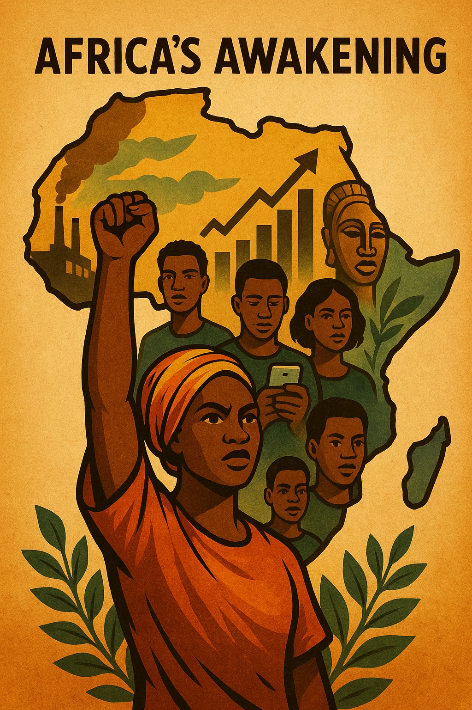

**Africa’s Awakening: Growth, Challenges, and New Opportunities in a Global Context**

(AI generated with ChatGPT 4o/Deep research; Image generated with Sora)

Africa is undergoing profound transformation. Once predominantly portrayed through narratives of crisis and poverty, the continent is increasingly seen as a dynamic engine of growth, innovation, and cultural influence. Yet this awakening is layered and complex: alongside notable economic advances, structural challenges persist. This essay explores Africa’s transformation across the dimensions of growth, digitalisation, industry, energy, culture, and governance.

---

### 1. Growth: The Continent of the Future

As of 2024, up to seven of the world’s ten fastest-growing economies are in Africa—including Niger, Senegal, Rwanda, and Côte d’Ivoire—depending on the metrics used. This growth is supported by a vibrant, youthful population: more than 60% of Africans are under 25, and the median age is just 19, compared to 42 in Europe. This demographic energy fuels rising consumer demand, innovation, and entrepreneurship.

Nigeria, for instance, sees over 500,000 tech-educated graduates enter the labour market each year. Africa’s consumer expenditure has reached approximately US $2.1 trillion, and the start-up scene is thriving—about 63% of tech funding on the continent is directed toward founders under 35.

Still, the growth is uneven. An estimated 12 million young people enter the labour force annually, yet only about 3 million formal jobs are created. Initiatives like Ethiopia’s Jobs Creation Commission and South Africa’s Youth Employment Service aim to narrow this gap.

---

### 2. Digitalisation as a Key Factor

Africa’s digital landscape is rapidly expanding. Internet use has grown from around 28% in 2019 to about 38% in 2024. 4G coverage now reaches roughly two-thirds of the population in Sub-Saharan Africa, and limited 5G services have been launched in at least 18 cities, including in South Africa and Kenya.

Africa’s internet economy is valued at around US $180 billion in 2024, with growth rates nearly double the global average. The fintech sector leads this charge—mobile money transactions surpassed US $1.6 trillion in 2024. Kenya’s M-Pesa and similar platforms have become cornerstones of financial inclusion.

Tech hubs in cities like Nairobi, Lagos, Accra, and Cairo are expanding, supported by global companies. Google’s “Startups Accelerator Africa”, Microsoft’s development centers in Nairobi and Lagos, and Amazon Web Services’ infrastructure in South Africa reflect rising investor confidence. Bosch, too, operates innovation centers and IoT initiatives in Kenya and South Africa, fostering locally adapted technology solutions.

---

### 3. Industry and Infrastructure: From Raw-Material Exports to Value Creation

Africa is shifting from raw-material exports to industrialisation and local value creation. Automotive production is growing rapidly: South Africa leads with over 600,000 vehicles produced annually, followed by Morocco with around 535,000. These countries serve export markets in Europe and beyond.

Egypt, Kenya and Nigeria have smaller but developing automotive sectors. While Volkswagen operates a pilot assembly facility in Rwanda, its scale remains limited. Morocco, with free zones and deep-water ports like Tanger-Med, has positioned itself as a regional export platform, hosting plants from Renault-Nissan and Stellantis. BYD, the Chinese electric vehicle giant, has also entered the African market, exploring partnerships and sales networks in Morocco⁵ and Kenya⁶ as part of its global expansion strategy—although its production footprint remains in early stages. Huawei is supporting the expansion of 5G and digital education on the continent, and Siemens is involved in industrial automation and energy infrastructure in several African countries.

Infrastructure projects are also on the rise. Smart cities such as Nigeria’s Eko Atlantic and Egypt’s New Administrative Capital symbolize broader ambitions to develop local supply chains and regional integration.

---

### 4. Renewable Energy and Climate Vulnerability

Africa is home to some of the world’s most promising renewable energy projects. Morocco’s Noor Ouarzazate Complex, one of the largest concentrated solar power (CSP) plants globally, and Egypt’s Benban Solar Park (1.65 GW) showcase the continent’s potential. Kenya, where over 90% of electricity is generated from renewables, leads in geothermal energy¹.

Africa is estimated to hold 60% of the world’s best solar energy potential, according to the IEA². Yet the continent receives only about 3% of global energy investment³. Solar capacity is expected to grow by 42% in 2025⁴ alone, adding up to 23 GW by 2028.

Despite this progress, climate vulnerability remains acute. Droughts, floods, and extreme weather events disproportionately impact African societies. Without improved infrastructure, grid development, and inclusive financing, much of this green potential may remain unrealized.

---

### 5. Culture and Influence: Africa’s Global Voice

Africa’s cultural presence is growing. Afrobeats dominates global charts; Kizomba and Highlife influence global music and dance. The diaspora in Brazil, the Caribbean, and the U.S. continues to shape cultural movements, from Capoeira to jazz.

Nollywood, Nigeria’s film industry, is among the world’s largest by number of productions. It tells African stories on African terms, building identity and exporting culture. Meanwhile, literature, fashion, and art are increasingly shaping global dialogues on equity, heritage, and aesthetics.

The Linux distribution "Ubuntu" reflects African values in global technology. Named after a Southern African philosophy meaning "I am because we are", it champions community and interconnectedness. While the OS itself is influential in open-source circles, it is more a symbolic than structural expression of the philosophy.

Ubuntu's ideas, however, resonate in modern leadership models that emphasize collaboration and growth. These overlap with Carol Dweck’s concept of the “growth mindset”, and are echoed in international leadership frameworks like the Arbinger Institute’s “Outward Mindset”, which prioritizes empathy and shared progress.

---

### 6. Structural Challenges and Sovereignty

Africa’s awakening is real—but fragile. Many states still contend with weak institutions, corruption, and dependency on external capital. Sierra Leone’s First Lady, Fatima Maada Bio, has highlighted how resource-rich countries often see their key sectors foreign-owned.

Conflict remains a major impediment. Insecurity in the Sahel, civil strife in Sudan, and violence in the DRC disrupt development and displace millions. Peace is not just a moral imperative but an economic necessity.

Efforts at reform are underway. Ghana’s national digital ID system, Tanzania’s contract renegotiations with mining firms, and Nigeria’s push for smart cities and manufacturing reflect a desire for greater economic sovereignty.

Still, challenges persist: rural internet penetration is only about 22%; around 38% of Africa’s highly skilled STEM graduates emigrate (though this figure varies by country and needs better tracking); and attracting investment without compromising sovereignty remains a balancing act.

---

### Conclusion

Africa is not a monolith but a tapestry of diverse trajectories. Its potential is undeniable: from fast-growing economies and renewable energy innovation to a rising digital ecosystem and resurgent cultural identity. Yet progress must be grounded in equitable development, peace, and sovereignty.

Projects like Kenya’s renewable grid or Morocco’s solar exports show that transformation is possible—but dependent on infrastructure, investment, and governance. As Fatima Maada Bio reminds us, sovereignty must be both political and economic. Only then can Africa’s awakening be sustainable and its prosperity genuinely shared.

## References

1. [U.S. Department of Commerce (2023): Kenya - Energy-Electrical Power Systems.](https://www.trade.gov/country-commercial-guides/kenya-energy-electrical-power-systems)

2. [International Energy Agency (IEA): Africa Energy Outlook 2022.](https://www.iea.org/reports/africa-energy-outlook-2022)

3. [REN21 (2023): Renewables 2023 Global Status Report.](https://www.ren21.net/gsr-2023/)

4. [Global Solar Council (2024): Africa's Solar Market Set to Surge 42% in 2025 – But Finance Bottlenecks Threaten Growth](https://www.globalsolarcouncil.org/news/global-solar-council-africas-solar-market-set-to-surge-42-in-2025-but-finance-bottlenecks-threaten-growth/)

5. [BYD SEAGULL Debuts in Morocco, Redefining the Benchmark for Urban E-Mobility](https://www.byd.com/mea/news-list/byd-seagull-morocco-launch)

6. [BYD’s Strategic Foray into Kenya: Electrifying East Africa’s Automotive Market](https://www.reportlinker.com/article/8396)

Generated by ChatGPT (https://chatgpt.com/share/68175853-f988-8010-a6cb-3b21cd7bdb9f)
