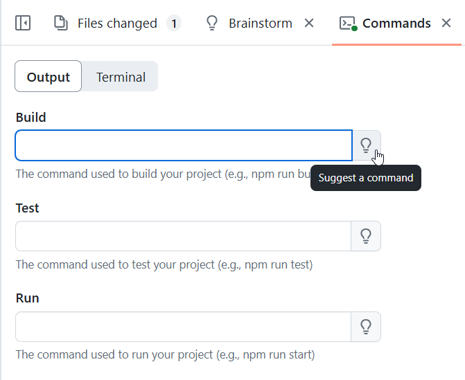

**My First Experience with GitHub Copilot Workspace**

**Why do we need such a thing?**

*TL;DR* - To make software development more accessible by relentlessly breaking down barriers with the assistance of AI agents.

Over the last decades, barriers to software development have significantly diminished, thanks to advancements like higher-level programming languages and powerful development tools. Modern Integrated Development Environments (IDEs) come equipped with features such as auto-completion, syntax highlighting, code suggestions, linters, and many more. These allow developers to focus on problem-solving rather than struggling with intricate language details.

The arrival of Generative AI has taken this accessibility to new heights by enabling the automatic generation of program code from natural language, opening up software development to an even broader audience. However, executing the code, testing it, and getting it reviewed through source code hosting platforms still require knowledge of how to set up a development environment, how to execute Git commands, and create a pull request, which remains a challenge for beginners. This is where [GitHub Copilot Workspace](https://gh.io/copilot-workspace) comes in, offering a streamlined solution by providing you with AI agents to brainstorm, generate code, create pull requests, and obtain terminal commands to build, test, and execute the software. With AI-native Cloud Development Environments like GitHub Copilot Workspace or [Replit](https://replit.com) — to name another one — you don't have to learn how to use a complex IDE anymore, since everything is provided to you in a modern web user interface.

With GitHub Copilot Workspace, you don't even have to write code anymore; you simply start by formulating your feature request or bug for your favorite project in natural language with a GitHub issue. A GitHub issue serves as a specification for Copilot Workspace. You can brainstorm with the AI agents on how to solve your issue. It provides you with a summary which helps you understand the necessary file changes, and you can ask further questions to get a better understanding. It provides you with a couple of suggested questions which help you discover and learn about the repository and related topics. By getting a better understanding, you can step-by-step add more details to your issue. When you are satisfied with the outcome of your brainstorming session, you can generate a plan for the file changes which you can modify and then let Copilot Workspace implement it.

This game-changer was first [announced](https://www.linkedin.com/posts/ashtom_github-copilot-workspace-welcome-to-the-activity-7190743877035700224-CRtx) by GitHub's CEO Thomas Dohmke in spring 2024 and was rapidly picked up by influencers like [Jeff Delaney](https://youtu.be/S_RorY_FRvo?si=3VbhcTu-zD3IjC_8) and [Rob Bos](https://youtu.be/N64ozm3x88k?si=OEqysoKwDSo59wJt). Half a year later, my excitement for Generative AI in IT hasn't waned. I've made it a habit to use various Copilots every day in both my professional and personal life to boost productivity and accelerate learning. At the GitHub Universe 2024 opening keynote, the passionate energy from [Orange Dynamite](https://youtu.be/dSf8QOjazrQ?t=1841) 🍊🧨 ignited my enthusiasm to dive right in. Luckily, [GitHub Next](https://githubnext.com) opened up the technical preview for a lot more people, and I received access too. In the following, I want to share my first experience with it.

The issue I selected for experimentation is [Carz #48](https://github.com/A5H73Y/Carz/issues/48), which describes a bug for a Minecraft server plugin I already know from my Minecraft times.

The first experience was a bit disappointing, since it ended in the error message "Unexpected error generating plan: Unexpected end of JSON input." Others already reported the same message in the [Discord channel](https://discord.com/channels/735557230698692749/1296372448018563145/1296372448018563145), and it got fixed quickly.

The Minecraft bug describes a scenario where cars can't climb out of tiny gaps. Opening the bug in the Copilot Workspace leads directly into a brainstorming session, where the current behavior and the proposed solution are described.

**What the AI found out about the current behavior:**

```
- No, cars cannot climb out of the tiny gaps in dirt path, soul sand, farmland, and honey blocks.
- The `src/main/java/io/github/a5h73y/carz/listeners/VehicleListener.java` file handles the vehicle update event and checks if the car should start climbing.
- The `calculateIsClimbable` method in `src/main/java/io/github/a5h73y/carz/listeners/VehicleListener.java` determines if the car should start climbing based on the block below and the block ahead.
- The current implementation does not account for the tiny gaps in dirt path, soul sand, farmland, and honey blocks, causing the car to get stuck.
```

The block below and the block ahead are factors that decide if the car is able to climb out of tiny gaps. What's a bit confusing is that concrete blocks are mentioned. This is error-prone since listing the concrete blocks instead of focusing on their common attributes leads to missing out on other similar blocks or when new blocks are added in Minecraft updates. It would be good to know what exactly makes them different from other blocks to cover more cases. Anyway, what does the AI propose as a solution?

**AI's Proposed Solution:**

```
- The `src/main/java/io/github/a5h73y/carz/listeners/VehicleListener.java` file handles the vehicle update event and checks if the car should start climbing.
- The `calculateIsClimbable` method in `src/main/java/io/github/a5h73y/carz/listeners/VehicleListener.java` has been updated to account for these blocks.
- The method now checks for the tiny gaps in dirt path, soul sand, farmland, and honey blocks and allows cars to climb out of them.
```

While the AI suggests updating the method to include these blocks, the solution appears somewhat limited, as it lacks detail on how to handle the climbing mechanics generically, which is essential for future-proofing against new block types. To delve deeper, I asked the AI to explain the issue description.

**Please explain the issue description**

```
The issue description explains a problem where cars in the game cannot climb out of small gaps in certain block types. Here are the key points:

- When a car enters an area of dirt path, soul sand, farmland, or honey blocks, it gets stuck against a full block instead of climbing the small height difference.
- The height difference for dirt path and farmland is 0.0625 blocks, and for soul sand, it is 0.125 blocks.
- The car behaves as if it is hitting a wall and cannot move forward.

This issue affects the gameplay by preventing cars from moving smoothly over these block types. The expected behavior is for the car to climb the small height difference and continue moving. The problem likely lies in the code that handles car movement and block interactions.
```

The AI provided a concise explanation of the issue, highlighting the specific block types and the nature of the problem, that helped in understanding the root cause which seems to be the missing differentiation between full blocks and partial blocks. So the next question asked about the differences between these.

**What is the difference between full blocks and partial blocks?**

```
The difference between full blocks and partial blocks in the context of this repository is as follows:

- Full blocks are blocks that occupy an entire block space in the game world. Examples of full blocks include grass blocks, dirt blocks, and stone blocks. These blocks are solid and have a full collision box, meaning that entities cannot pass through them.
- Partial blocks, on the other hand, are blocks that do not occupy the entire block space and have a smaller collision box. Examples of partial blocks include slabs, stairs, and honey blocks. These blocks have gaps or reduced height, allowing entities to partially pass through or climb over them.

In the context of the issue described, cars are unable to climb out of the tiny gaps in dirt paths, soul sand, farmland, and honey blocks because these are partial blocks with reduced height, and the cars treat them as if they were full blocks, resulting in the cars getting stuck. The climb mechanic checks for valid materials and space above the block to climb, but it seems to fail for these partial blocks. This behavior is likely due to the way the collision detection and climb mechanics are implemented in the code.
```

The AI clarified the distinction between full and partial blocks, emphasizing how the collision mechanics differ, which is crucial for addressing the climbing issue and points out that the bug is probably related to the collision detection. 

**How can partial blocks be handled in a generic way?**


**What are the conditions and forces, based on Minecraft's game physics, to allow climbing?**

```
The conditions and forces, based on Minecraft's game physics, to allow climbing in the Carz plugin are as follows:

- The block below the car must be solid and not air.
- If there are no specified climb blocks, all solid blocks are climbable.
- If the `ClimbBlocks.AllSlabs` configuration is enabled, slabs are climbable.
- If there are specified climb blocks, the material of the block ahead must match the whitelist of climbable blocks.
- The block above the block ahead must be air to allow climbing.
- The car's velocity is adjusted to climb by setting the Y component of the velocity to the value specified in the `ClimbBlocks.Strength` configuration.

These conditions and forces are implemented in the `src/main/java/io/github/a5h73y/carz/listeners/VehicleListener.java` file. The `calculateIsClimbable` method checks the conditions for climbing, and the `onVehicleUpdate` method adjusts the car's velocity to allow climbing if the conditions are met.
```

*Takeaway:* The AI outlined the underlying mechanics and conditions required for climbing, suggesting that adjusting the code to consider these could resolve the issue generically.

**How is the block below determined?**

```
The block below is determined in the `onVehicleUpdate` method in the `src/main/java/io/github/a5h73y/carz/listeners/VehicleListener.java` file. Here are the steps involved:

- The `blockBelow` is calculated by subtracting 1 from the Y-coordinate of the vehicle's current location: `event.getVehicle().getLocation().subtract(0.0D, 1.0D, 0.0D).getBlock()`.
- The `materialBelow` is then determined by getting the type of the `blockBelow`: `blockBelow.getType()`.

This information is used to check for specific block types and apply corresponding effects to the vehicle's movement.
```

*Takeaway:* Understanding how the block below is determined allows for modifications to include the heights of partial blocks, which is essential for solving the climbing issue.

**How is the block ahead determined?**

```
The block ahead is determined in the `src/main/java/io/github/a5h73y/carz/listeners/VehicleListener.java` file.

- The `onVehicleUpdate` method calculates the block ahead by getting the player's location and direction.
- It clones the player's location and sets the pitch to 0.
- It then adds the player's direction multiplied by 2 to the location to get the location two blocks ahead.
- The Y-coordinate of the location is set to the maximum of the player's Y-coordinate plus 1 and the Y-coordinate of the location two blocks ahead.
- The block at this location is then checked to determine if it is climbable.
```

*Takeaway:* Knowing how the block ahead is calculated helps in adjusting the code to account for the height differences of partial blocks.

**Add a new method `getBlockHeight` to calculate the height for the block type below and use it to set the Y-coordinate of two blocks ahead.**

*Different ideas are presented. The AI explained them and why to choose a particular approach.*

*Takeaway:* The AI suggested creating a method to dynamically determine block heights, allowing the climb mechanic to adapt to any block type based on its height attribute, making the solution more generic and robust.

**Can you please make the 1.0 configurable, so that I can change it while the game is running?**

```
To make the `1.0` configurable so that it can be changed while the game is running, you can follow these steps:

- Add a new configuration entry in the `config.yml` file to store the value of `1.0`. For example, you can add an entry like `Other.SomeConfigurableValue: 1.0`.
- Update the `DefaultConfig` class in `src/main/java/io/github/a5h73y/carz/configuration/impl/DefaultConfig.java` to include the new configuration entry. You can use the `addDefault` method to set the default value.
- Create a getter method in the `DefaultConfig` class to retrieve the value of the new configuration entry. This method should return the value from the configuration file.
- Update the relevant parts of the code where the value `1.0` is used to retrieve the value from the configuration file using the getter method from the `DefaultConfig` class.
- Ensure that the configuration can be reloaded while the game is running by using the `/carz reload` command, as mentioned in the documentation in `docs/tutorials/plugin-config.md`.
```

*Takeaway:* Making the value configurable enhances flexibility, allowing real-time adjustments without restarting the game, which is beneficial for testing and fine-tuning.

---

*This can be achieved easily by clicking on the "Open commands" icon at the upper right toolbar and pressing the light bulb for the command you want to execute, as depicted below.*



*The AI will generate the necessary command which can be executed in the underlying GitHub Codespace, automatically initiated by Copilot Workspace with the required build tools. There is no manual setup of a development environment anymore. Everything is accessible from Copilot Workspace through a web browser—even on a smartphone—eliminating the need for a local setup.*

**Tips:**

- *Entering the same question does not always lead to the same response. Sometimes it gives better results when starting a new session and entering the same question again.*
- *Try out variants of questions by adding phrases like "explain it in detail," "explain it by leaving out implementation details," or "explain it to me like I'm 10."*
- *When you have further questions about a response from a brainstorming session, copy and paste the response into the prompt and append your question to it.*
- *You can paste in code snippets or pseudocode which demonstrate an approach to your brainstorming prompt to guide you on how to integrate it.*

---

My first experience with GitHub Copilot Workspace was enlightening, offering a glimpse into the future of AI-native software development. It demonstrated how AI and human creativity can collaborate to tackle complex challenges. While the AI agents provided valuable insights and practical solutions, the initial proposal for my issue wasn't entirely robust against potential block type changes in future Minecraft updates. Still, I'm excited to see how this technology evolves, empowering not just professional developers but also anyone curious about software to achieve extraordinary things.
